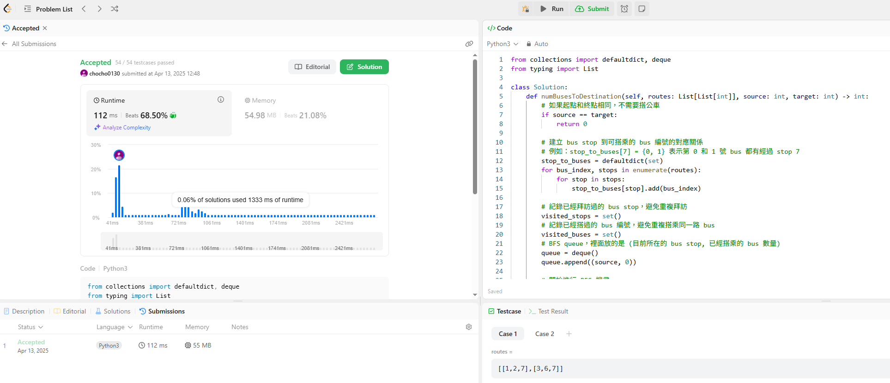

有一個 routes list，表示多條公車路線，routes[i] 是第 i 條公車路線
的所有站牌，且該公車會無限循環在這些站之間。回傳從 source 抵達
target 搭乘最少的公車數量，如果無法到達，請回傳 "-1"。

換句話說就是想辦法從起始點一直換乘公車，然後最少換乘到達目的地。
解題思路：
1. 將每個 bus stop 對應到它可以搭乘的 bus index。

2. BFS 的起點是 source bus stop，我們會從這些 bus stop 可以搭的公車開始擴散。

3. 進入下一層的 bus stop 表示「我們多搭了一台公車」，因此 BFS 的層數就是我們所求的答案。

4. 需要追蹤哪些 bus 已搭過、哪些 stop 已訪問過，避免重複。

