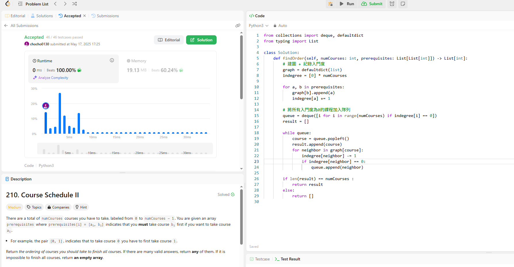

一共 numCourses 門課要修，課程編號從 0 到 numCourses - 1。每門課
有可能有「先修課」的限制，這些限制會用一個陣列 prerequisites [a,
b] 呈現，即要先修完課程 b，才能去修課程 a。請回傳一個可行的「修
課順序」陣列，若無法修完全部課程則回傳空陣列。

這題可以用graph加上Kahn's Algorithm（BFS） 來解，我創造一個graph和一個indegree。

說明
graph 存每一門課的後續可修課程。

indegree 每一門課有幾門要修。

用 BFS 把所有indegree為 0 的課程排進結果中，如果最後結果長度不等於 numCourses，就代表有循環，無法完成課程。

