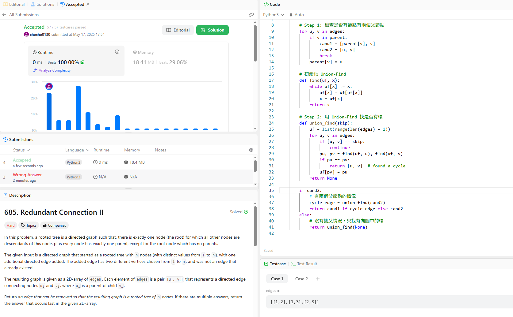

題目簡單說明：

原本是一棵樹，但它多了一條邊。

有根樹定義
1.只有一個根節點(root)，其餘所有節點都是這個 root
的後代 
2.除了 root 以外，每個節點只能有一個父節點。現在有一個
「本來是一棵有根樹」的有向圖，並給了一個 2 維陣列 edges，每個元
素是 [u, v]，代表一條「u 指向 v」的有向邊。回傳哪一條邊可以被移
除，能讓這個圖重新變回一棵有根樹，而若有多種選擇，則回傳在
edges 陣列中較後出現的邊。

解法
我寫了但失拜，最終只能求助ai，我原本考慮的邏輯是最多連線的點是要刪除的，但最後提交還是錯

ai解法
先檢查是否有節點有兩個父節點（這是合法有根樹中不允許的）。

如果有，就暫時把第二個父邊跳過，用 Union-Find 看是否還會有環。

有環代表第一條多的邊（cand1）是問題。

沒環代表第二條邊（cand2）是問題。

如果每個節點都只有一個父節點，那就是經典的有向圖成環問題，直接用 Union-Find 找那條造成環的邊。

