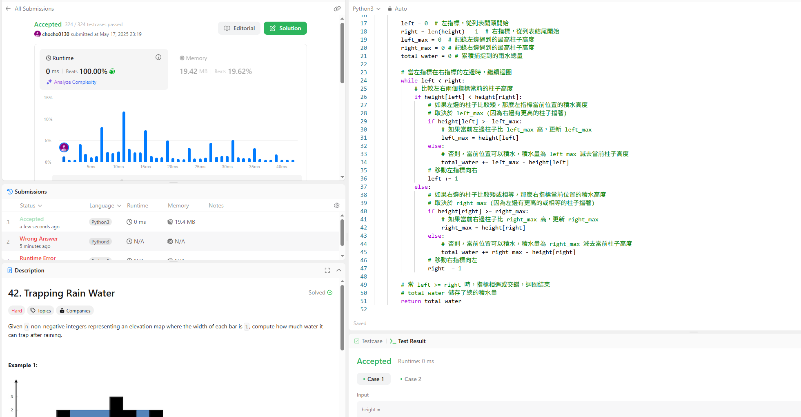

題目描述：

給定一個非負整數列表 height，代表一個柱狀圖的高度，每個柱子的寬度都是 1。計算這個柱狀圖在下雨後可以積累多少雨水。
這題目比較抽象的地方是你要把圖畫出來才比較能想像他能裝多少低窪的水，對於位置 i，它上面水的高度，是由它左邊最高的柱子高度 (left_max) 和它右邊最高的柱子高度 (right_max) 中較小的那個決定的。

解法思路 
使用雙指標：

設置指標和最大高度記錄：

初始化兩個指標，left 指向列表的最左邊 ，right 指向列表的最右邊 
初始化 left_max = 0 和 right_max = 0，分別記錄從左邊和右邊掃描時遇到的最高柱子高度。
初始化 total_water = 0，用來累積總的積水量。
移動指標計算積水：

當 left < right 時。
在每一步中，比較 left 和 right：
如果 left < right 表示左邊的柱子比較矮。
在這種情況下，位置 left 上的積水高度，只會受到 left_max 的限制
更新 left_max = max(left_max,left)
計算在位置 left 上的積水：left_max - left 將這個積水量加到 total_water 中。
將 left 指標向右移動一位 (left += 1)。
如果 left >= right 這表示右邊的柱子比較矮或一樣高。同理，位置 right 上的積水高度，只會受到 right_max 的限制。
最後 將 right 指標向左移動一位 (right -= 1)。
結束：

當 left 和 right 指標相遇或交錯 (left >= right) 時結束。
total_water 就是計算出的總積水量。

寫錯才使用ai，但因為要理解邏輯才全+註解
