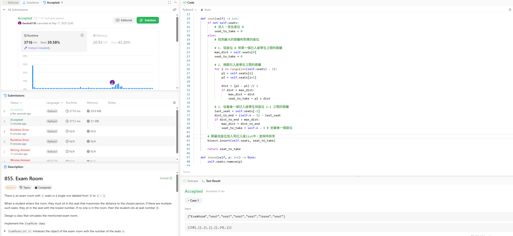

題目介紹
有一個class需要我們實作 他有兩個功能一個是seat另一個是leave。
當學生入座時總是選擇離其他人最遠的位置。如果有好幾個這樣的位子，就選編號最小的。如果考場是空的，就坐 0 號位子。

做法

def init
初始化兩個變數
初始化考場的座位總數 n。
建立一個空list，名稱為 self.seats 用來儲存已入座的學生編號。保持這個列表的排序狀態，方便計算距離。
def seat
如果 self.seats 是空的，直接回傳座位 0
座位不為空時
初始化 max_dist 和 seat_to_take。
max_dist 儲存目前找到的最大距離，seat_to_take 儲存對應的最佳座位號碼。
先假設座位 0 是最佳選擇。
接著，for迴圈 self.seats 列表，計算每對相鄰已入座學生之間的距離，並計算他們中間的座位號碼。如果這個距離比當前的 max_dist 大，就更新 max_dist 和 seat_to_take。
然後，考慮從最後一個已入座學生到座位 n-1 之間的距離。如果這個距離更大，更新 max_dist 和 seat_to_take 為 n-1。
計算和比較完成後，seat_to_take 就儲存了應該入座的最佳座位號碼。

這裡最方便是使用 bisect.insort(self.seats, seat_to_take) 將新的座位號碼插入到 self.seats 列表中，同時保持列表的排序。bisect 模組的 insort 方法可以高效地完成這個任務。
最後返回 seat_to_take。

def leave
使用 self.seats.remove(p) 將離開的學生編號 p 從 self.seats 移除，這個也是最簡單的。

