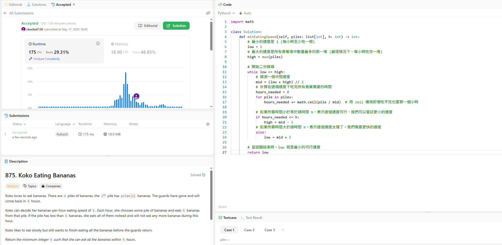

題目介紹

有很多堆香蕉，每一堆的數量可能不一樣。他要吃完所有的香蕉。必須在 h 小時內。他可以自己決定每小時要吃多少根香蕉，稱這個速度為 k。

每小時，他會選擇一堆香蕉，然後吃掉 k 根。如果那一堆的香蕉數量少於 k 根，他會把那一堆全部吃光，但這個小時就不會再吃其他堆了。

我們的目標是找到最小的 k，讓他可以在 h 小時或更短的時間內吃完所有的香蕉。

題目方法:
我一開始的策略是 從每小時吃一根開始，然後計算吃完總共的時間，如果超過時間就在提高每小時吃的數量，但是這個方法會超時，所以我只好使用二分搜尋法，要不然時間會超時，二分搜尋法用設定一個速度的範圍，然後不斷地在這個範圍內猜測中間值，看看這個速度是否可行。如果可行，我們就嘗試更小的速度；如果不可行，我們就嘗試更大的速度。這樣不斷縮小範圍，最終就能找到最小的可行速度。

