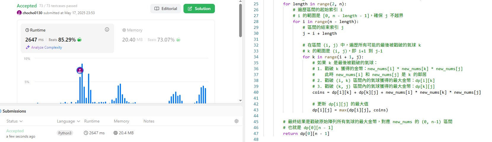

題目描述
從一個整數陣列 nums 中戳破所有氣球，並想辦法獲得總硬幣數量最大。

流程:每戳破一顆氣球，你會得到的分數為：左側氣球數值 × 當前氣球數值 × 右側氣球數值。
如果左右超出陣列範圍，則當作是數值為 1 的虛擬氣球。

這題目最難的地方是邊界會改變、要戳哪一顆氣球

使用動態規劃 DP

DP 陣列的維度和遍歷順序：

DP 陣列 dp 是二維的，大小為 (n+2) x (n+2)。
遍歷順序：我們需要先計算短區間的 DP 值，再用它們計算長區間的 DP 值。
外層迴圈可以遍歷區間的長度 length，從 2 開始到 n+2。
內層迴圈遍歷區間的起始索引 i，從 0 到 n+2 - length。
區間的結束索引 j 就是 i + length。
最內層迴圈遍歷最後被戳破的氣球索引 k，從 i + 1 到 j - 1。

因為我解不出來還有時間問題所以我上網求助ai，並將註解詳細保留

