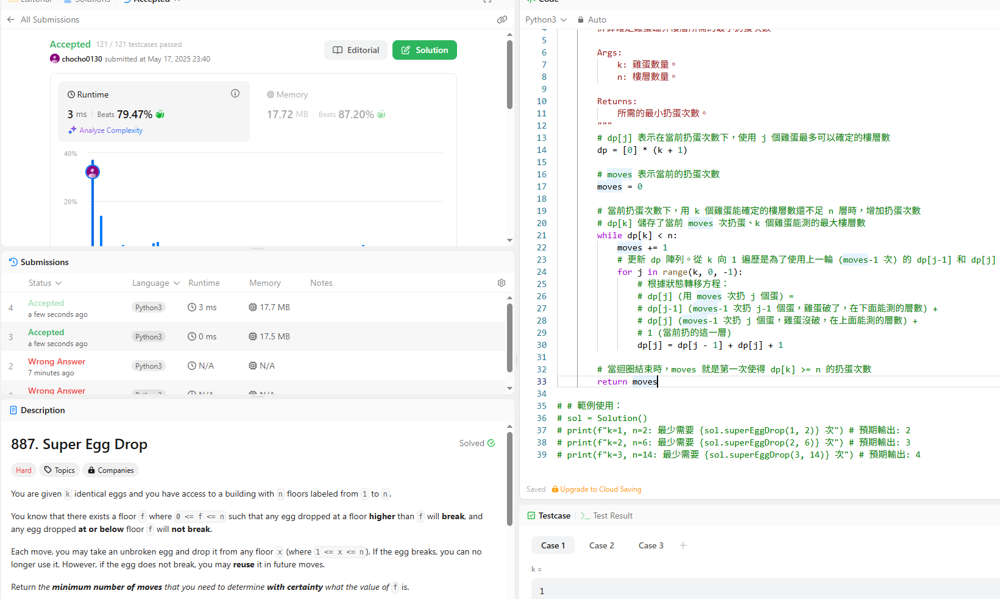

題目描述：

有 k 個一樣的雞蛋，以及一棟從 1 到 n 層的建築。知道存在一個樓層 f ( 0 <= f <= n )，滿足：

任何從高於 f 的樓層掉落的雞蛋都會破。
任何從低於或等於 f 的樓層掉落的雞蛋都不會破。
每次行動，你可以拿一個沒破的雞蛋，從任一層樓 x ( 1 <= x <= n ) 扔下去。如果雞蛋破了，你就不能再用它了；如果沒破，下次還可以繼續用。

目標是：用最少的扔雞蛋次數，來確定 f 的值是多少。要求返回這個最少的扔雞蛋次數。

方法

這週就是使用DP

定義一個 dp[m][k] 表示在最多扔了 m 次，並且擁有 k 個雞蛋的情況下，最多可以確定多少層樓的臨界樓層 f。

目標是找到最小的 m，使得 dp[m][k] >= n。

雞蛋會有兩種狀況 破了跟沒破

破了>知道臨界樓層 f 一定在 x 層以下 (包括 0 到 x-1 層)，往下找

沒破>知道臨界樓層 f 一定在 x 層或以上 (包括 x+1 到 n 層)，往上找

DP 狀態轉移方程為：

dp[m][k] = dp[m-1][k-1] + dp[m-1][k] + 1

這個方程的含義是：在 m 次扔蛋、k 個雞蛋的情況下，可以確定的最多樓層數，等於在 m-1 次扔蛋時，雞蛋破了 (用 k-1 個蛋確定 dp[m-1][k-1] 層) 和雞蛋沒破 (用 k 個蛋確定 dp[m-1][k] 層) 所能覆蓋的樓層數總和，再加上當前扔的這一層。

由於dp真的太難我想不到，最後求助ai，我把解法註解都留下來學習

