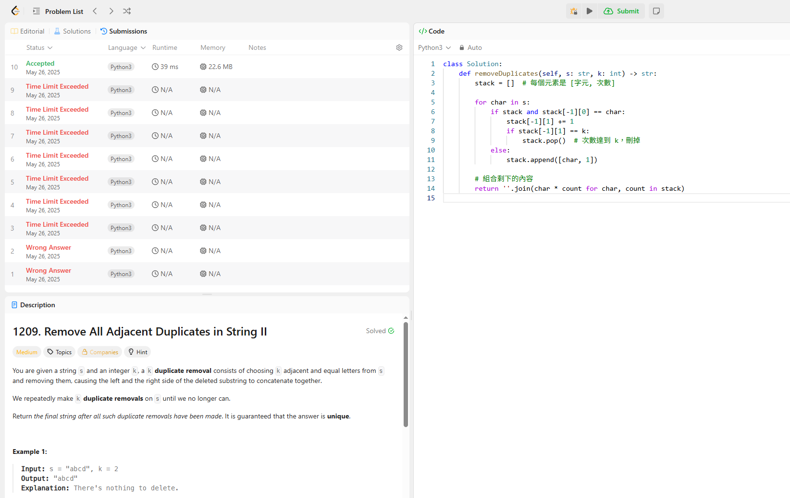

## 題目:
1209. Remove All Adjacent Duplicates in String II
## 題目敘述: 
給一個字串 s 和一個整數 k，一直移除 k 個相鄰且一模一樣的字，直
到無法再移除為止，最後把剩下的字串重新接在一起。

## 我的作法:
一開始使用暴力法，但是最後會超時，所以我上網參考，最後採用stack的解法，用 stack 來更有效率地追蹤重複出現的字元與次數。

## 解釋：
用一個堆疊 stack，每個元素是 [字元, 連續出現次數]。

如果遇到相同字元就累加次數，滿 k 就 pop。

最後把堆疊中剩下的 [char, count] 重建成結果字串。

