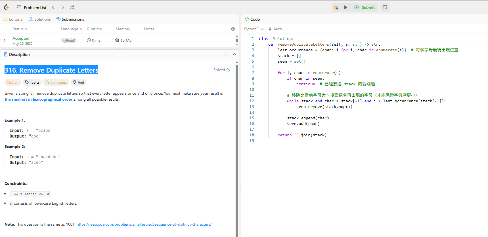

## 題目
 Leetcode 316 Remove Duplicate Letters

 ## 題目解釋

 給定一個字串 s，請移除重複字母，以達到每個字只出現一次，並在
所有符合條件的組合中，回傳字典序 (Lexicographical Order) 最小的那
個字串作為答案，同時不能不能打亂原來字母的順序。

這題目最難的點是
>每個字只能出現一次，且結果要是「字典序最小」的答案。

##  解題方法：

這題我真的想不到解法，字典序最小這很難解釋，最終參考網路ai解法使用單調棧（monotonic stack） 來維持字典序的最小性，同時保證字母唯一。

## ai解釋

✅ 範例解釋：
以 "cbacdcbc" 為例：

當處理到 "c" → stack: ['c']

處理 "b"：b < c 且 c 之後還會再出現 → 把 c pop

最後得到 "acdb"

