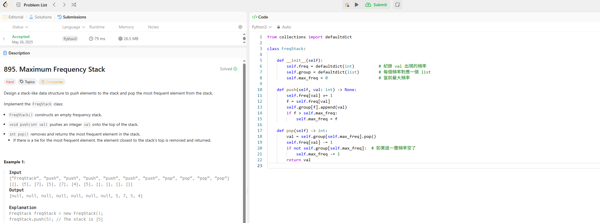

## 題目
 895. Maximum Frequency Stack

 ## 題目解釋

 設計一個Stack，裡面除了有init()以外還有兩個功能 push()和pop()需要完成

push(val) 就是沒有字的時候要加進來，然後有的要增加頻率，pop() 時要根據「元素出
現的頻率」來決定要移除哪個元素，若有多個頻率一樣，則回傳「最接
近 stack 頂端的那個元素」。

##  解題方法：
freq[val]: 紀錄每個值的頻率。

group[f]: 將頻率為 f 的所有值（按順序）存成一個 stack。

所以我需要兩個dict

然後max_freq: 快速找出當前最高頻率，主要是方便我們pop，同時防止超時

