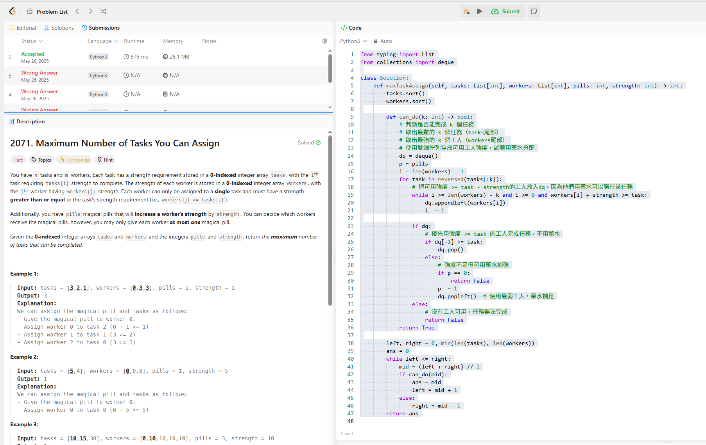

## 題目

2071. Maximum Number of Tasks You Can Assign

## 題目說明

有一批任務 「tasks」與一批工人「workers」
每個任務需要一定的「strength」才能完成，而每位工人也各自有一個固定的「strength」。此
外，還有一些藥丸「pills」，每顆藥丸可以提升一位工人的「strength」
值，但每位工人最多只能吃一顆藥丸。每位工人最多只能執行一個任
務，並只能執行其「strength」值大於或等於需求的任務。在給定的工
人、任務、藥丸數量與藥效強度下，請找出最多可以分配的任務數量。

這題目敘述跟變數有點多 

## 題目做法

我的原始寫法是暴力遍歷 tasks 和 workers，每一個 task 嘗試匹配一個 worker，並且根據是否有藥丸決定是否能強化工人。這樣的時間複雜度是 O(n × m)，會在 LeetCode 上 TLE（Time Limit Exceeded）。

> 更有效率的思路：二分搜尋 + 雙端佇列配對
思路整理：
想辦法二分搜尋最多能完成幾個任務。

每次 check 是否能完成某個任務數 k 時，用雙端佇列（deque）去搭配工人與任務排序，嘗試配對。

使用 heapq、deque、bisect 等工具進行優化匹配。

## 最佳解法：使用 Binary Search + Greedy

