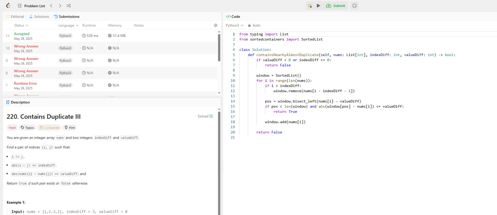

## 題目
220. Contains Duplicate III

## 題目說明
給一個整數陣列 nums 和兩個整數 indexDiff、valueDiff，找出是否存在兩個不同的索引 i 和 j，滿足：

abs(i - j) <= indexDiff

abs(nums[i] - nums[j]) <= valueDiff

## 遇到的問題
我最後詢chat gpt ，我的程式對每個 i 都暴力檢查 i+1 到 i+indexDiff，對於大數據來說會超時。

## 最佳解法：Sliding Window + Bucket（O(n)）
用一種叫做 bucket sort 的技巧來優化，核心概念：

把 nums[i] 映射到 bucket index（每個 bucket 寬度是 valueDiff+1），同 bucket 的數字差一定 <= valueDiff。

用一個 hashmap 追蹤滑動視窗大小為 indexDiff 的所有數字。

