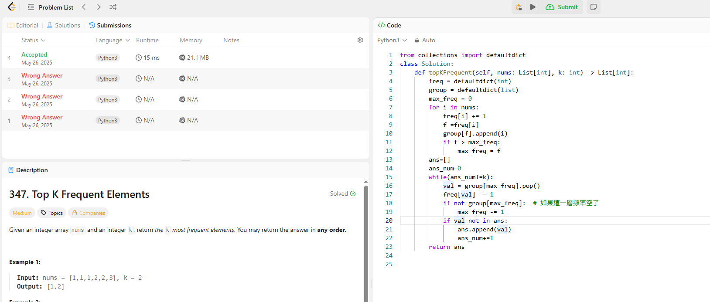

## 題目
347. Top K Frequent Elements
## 題目說明

輸入：nums 是一個整數陣列，k 是要找的高頻元素個數

輸出：出現頻率最高的前 k 個元素（不用管順序）

限制：時間複雜度要優於 O(n log n)

## 作法解釋

我是拿上一周最後一個題目895的程式碼來改

freq[val]: 紀錄每個值的頻率。

group[f]: 將頻率為 f 的所有值（按順序）存成一個 stack。

所以我需要兩個dict

然後max_freq: 快速找出當前最高頻率，主要是方便我們pop，同時防止超時

最後在依序從最高頻序將答案輸出，並確保不會輸出重複

