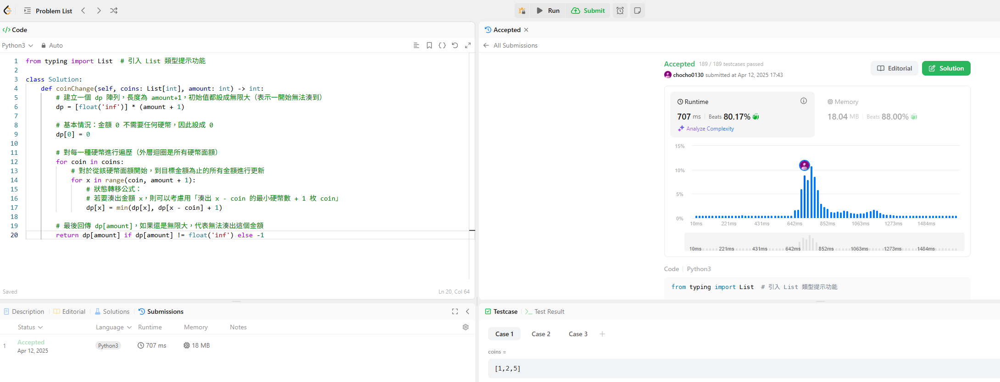

這周的主題是Breadth-first search, BFS，這一題就是會有一個list裡面有幾個不同幣值硬幣，用最少硬幣找到這個金額。其中每種面額的金幣可以無限使用，
若無法湊出該金額，則回傳 "-1"。

我原本寫的是 recursive backtracking，但存在幾個問題
1. 沒有 return 值的遞迴呼叫
2. 沒有遍歷所有可能組合
3. 沒有剪枝，也沒有記憶化

最後是用bfs解決
