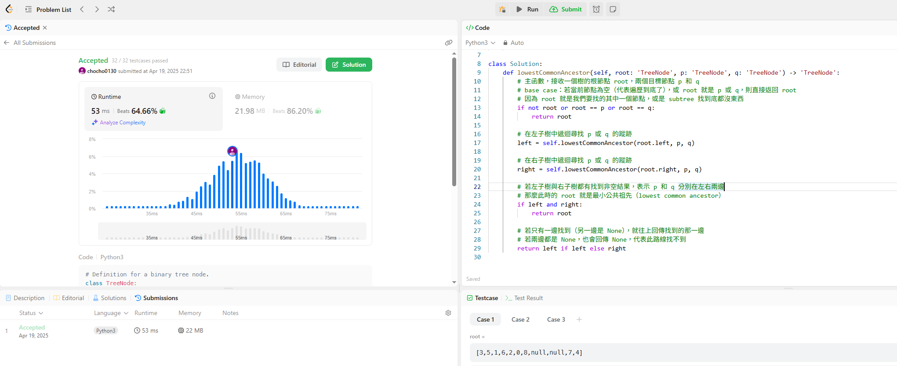

## Topic: Depth-First Search, DFS

上週是BFS這周是DFS，這題是，給定一棵二元樹，和其中的兩個節點 ，請找出它們的最近共同節點。

## 演算法邏輯說明
這段程式碼使用的是 後序遍歷（post-order traversal） 的思維，也就是：

- 先遞迴左子樹 ➝ 遞迴右子樹 ➝ 最後在根節點作出判斷

## 思考流程：
1. 從根節點往下遞迴找 p 和 q。

2. 當某個節點是 p 或 q，就回傳它自己。

3. 若從某個節點的左、右子樹都分別找到了 p 和 q，代表該節點就是它們的「最低共同祖先」。

4. 如果只在一邊找到（另一邊是 None），就返回那一邊的結果。

5. 如果兩邊都沒有（都是 None），那就返回 None，表示這條路徑與 p、q 都無關。

