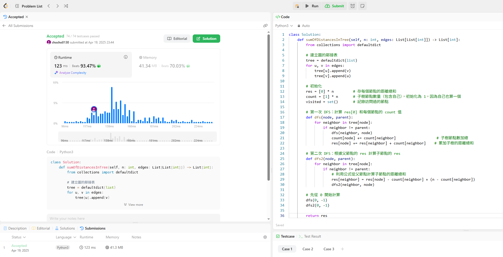

## 題目：
有一棵無向且連通的樹，包含 n 個節點，節點標號從 0 到 n - 1。\
這棵樹總共有 n - 1 條邊，每條邊都是一對節點 [a, b]，表示節點 a 和 b
有連接。請你返回一個長度為 n 的整數陣列 answer，其中 answer[i] 是
節點 i 到所有其他節點的距離總和。

## 解題關鍵想法（兩次 DFS）
這題用暴力法會 TLE，所以挺難的

改使用 兩次 DFS 的動態規劃解法：

第一次 DFS：計算每個節點的：

子樹節點個數 count[x]

距離總和 res[0]（從根節點 0 出發，累加所有距離）

第二次 DFS：以 res[0] 為基礎，從父節點轉移到子節點，推導每個節點的 res[i]：

根據公式：
> res[child] = res[parent] - count[child] + (n - count[child])

