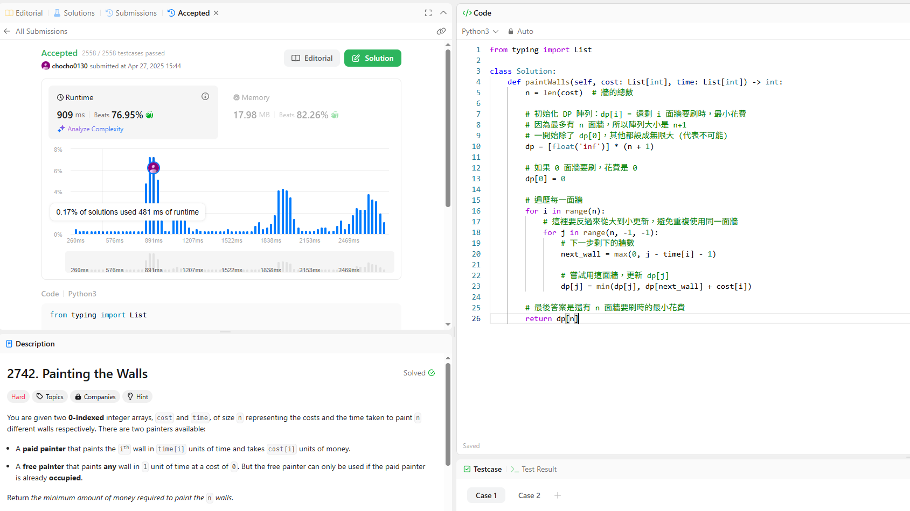

題目介紹
給兩list：

cost[i]：花錢請付費工人刷第 i 面牆要多少錢

time[i]：付費工人刷第 i 面牆要多少時間

有兩種工人可以刷牆：

付費工人：刷第 i 面牆要 cost[i] 的錢，花 time[i] 單位時間。

免費工人：每次刷牆只要 1單位時間，不用錢，但只能在付費工人工作時同步動作（付費工人得忙著刷牆，免費工人才可以動）。

>免費工人算是附帶贈品的概念

目標：把所有牆刷完，花最少的錢。

解題想法
>因為免費工人必須「付費工人在刷的時間裡」才能刷，所以我們需要小心分配哪面牆找付費工人刷，剩下用免費工人處理。

用動態規劃（DP）的方法：

dp[i]：表示「還剩下 i 面牆要刷」時，最小的總花費。

轉移方式：

每次可以選一面牆，用付費工人刷，它會用掉 time[i] 單位時間，代表最多 time[i] + 1 面牆（自己那面加上免費工人能處理的時間）可以被刷掉。

這樣從 i 變成 max(0, i - time[j] - 1)。

