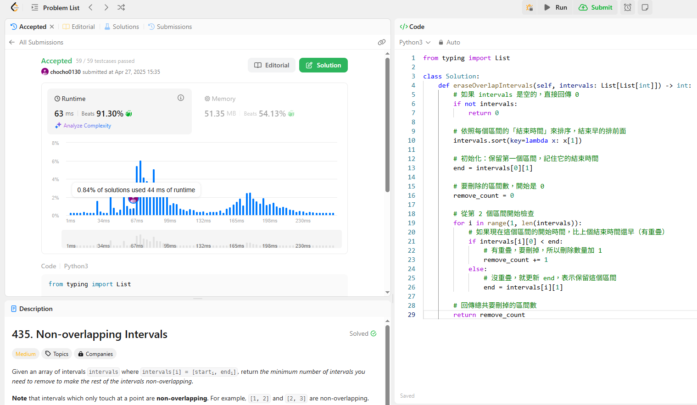

給一個list，裡面很多區間（像 [1,3]、[2,4] 這種）， 要刪掉最少的區間，讓剩下的區間都不重疊。

>注意：如果兩個區間剛好接起來（比如 [1,2] 和 [2,3]），這樣是不重疊的。

解題思路
先排序所有區間，按照「結束時間」從小到大，這題跟之前757很像，一樣要先按照區間大小排列。

一個一個選，如果新的區間跟前面的有重疊，就刪掉（計數器加一）。

最後回傳刪掉的區間數。

