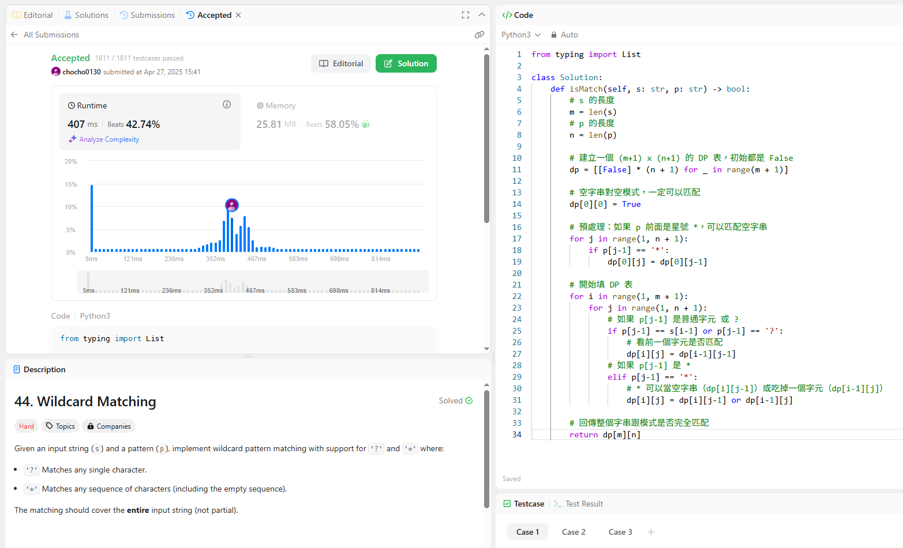

題目說明
給兩個字串：

s 是要比對的字串

p 是模式（可以包含特殊符號 ? 和 *）

規則：

? 可以匹配任意一個字元。

* 可以匹配任意多個字元（可以是0個、1個、很多個）。

重點：整個字串都要比對完成，不能只比對一部分。

解題思路
用**動態規劃（DP）**來做：

設一個 dp[i][j] 表示：

s 的前 i 個字元

p 的前 j 個字元

是否能成功匹配（True or False）

```
轉移規則：

如果 p[j-1] == s[i-1] 或 p[j-1] == '?'，就看前一格：dp[i-1][j-1]

如果 p[j-1] == '*'：

dp[i][j] = dp[i-1][j] （* 吃一個字元）

或 dp[i][j] = dp[i][j-1]（* 當作空字串）
```

